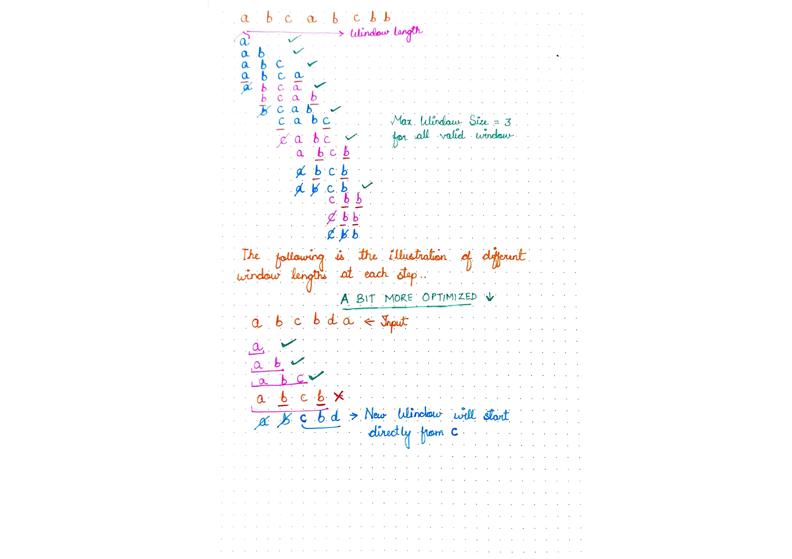

# 3. Longest Substring Without Repeating Characters

Given a string `s`, find the length of the **longest substring** without repeating characters.

**Example 1:**

```
Input: s = "abcabcbb"
Output: 3
Explanation: The answer is "abc", with the length of 3.
```

**Constraints:**

* `0 <= s.length <= 5 * 104`
* `s` consists of English letters, digits, symbols and spaces.

## Solutions

_**The general intution behind this problem is sliding window, since we need a substring**_. The idea is to increase the window size by moving right pointer when non repeating char is found, and decrease the window size by moving left pointer till any repeating char is found. Then find the max valid size window. To find the repeating chars, we can use either dict or set, etc. Let's have a look.                 &#x20;



<mark style="color:blue;">**1. Use Dictionary:**</mark> We will store the frequency of char in dict. Once we find frequency greater than 1, we will decrease the window size till frequency of that char becomes <= 1. So each window\[i...j] will be valid. <mark style="color:purple;">We just need to find max windows size among all valid window sizes.</mark>

```python
# TC - O(n) ( at worst we visit each element twice to remove or add in window)
# SC - O(n) ( initialise dict )
class Solution:
    def lengthOfLongestSubstring(self, s: str) -> int:
        d = defaultdict(int)
        i = 0
        j = 0
        max_c = 0
        while(i < len(s)):   
            d[s[i]] += 1
                
            while d[s[i]] > 1:
                d[s[j]] -=1
                j+=1 
                
            else:
                 max_c = max(max_c, i - j + 1)
        
            i+=1
         
        return max_c
```

<mark style="color:blue;">**2. Use sets:**</mark> It is not necessary to store count if we use sets. The approach is very similar to above. As we encounter any element in set that exists, we will move our left pointer ( decrease window ) till our window is valid. And for every valid window, we will keep on adding elements.

```python
# TC - O(n)
# SC - O(n) ( initialise set )
class Solution:
    def lengthOfLongestSubstring(self, s: str) -> int:
        d = set()
        i = 0
        j = 0
        max_c = 0     
        while(i < len(s)):  
            if s[i] in d:
                d.remove(s[j])
                j+=1 
            else:    
                d.add(s[i])
                i+=1
                max_c = max(max_c, i - j)
         
        return max_c
```

<mark style="color:blue;">**3. Further Optimise using dict:**</mark> We can optimise our approach to decrease window size. Instead of removing character from window one by one, we can slide the new start of the window directly. The new start of the window will be `i + 1`, where `arr[i]` is the repeating character. For this we need to keep track of index of each character in dictionary instead of keeping the count.

_How do we keep track of what element has been removed from window?_

Since, we do not keep track of frequency, neither do we remove the element from dict if taken out from window, **we check the condition if dict\[element] >= start\_index\_of\_window to see if this element has been already taken in the window.**

```python
# TC - O(n)
# SC - O(n) ( initialise dict )
class Solution:
    def lengthOfLongestSubstring(self, s: str) -> int:
        d = dict()
        i = 0
        j = 0
        max_c = 0
        while(i < len(s)):    
            if s[i] in d and d[s[i]] >= j:
                j = d[s[i]] + 1
                
            else:      
                max_c = max(max_c, i - j + 1)
                
            d[s[i]] = i   
            i+=1
         
        return max_c
```
