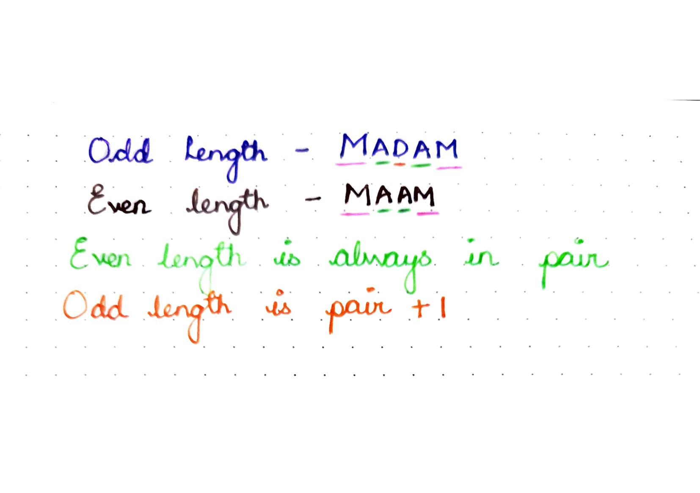
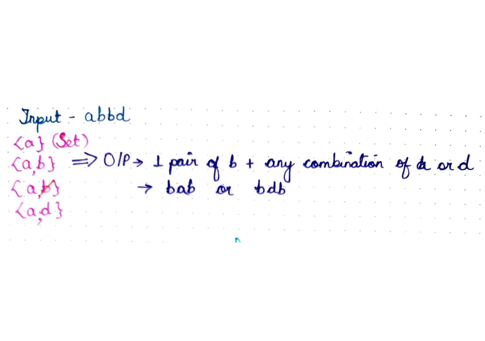

## 409. Longest Palindrome

Given a string `s` which consists of lowercase or uppercase letters, return _the length of the **longest palindrome**_ that can be built with those letters.

Letters are **case sensitive**, for example, `"Aa"` is not considered a palindrome here.

**Example 1:**
<pre>
<b>Input:</b> s = "abccccdd"
<b>Output:</b> 7
<b>Explanation:</b> One longest palindrome that can be built is "dccaccd", whose length is 7.
</pre>

**Constraints:**

-   `1 <= s.length <= 2000`
-   `s` consists of lowercase **and/or** uppercase English letters only.


### Solutions

The intution behind the solution is to get the possible palindrome sequence from the string. It could either be odd or even length.  An even length palindrome is only possible if each character is in pair.  For odd length palindrome, we must have `pair + 1` combinations.                  &#x20;



<mark style="color:purple;">**1. Set:**</mark> We will iterate over the string and use set to keep track of pair of each character. Once, a pair is found, we will count it as 1 pair for the character and remove that element from the set. If no pair is found for the character, we will keep adding that element in set. Finally, we will result the answer as `length of pairs` if set is empty or `length of pairs + 1`  if set is not empty. <mark style="color:blue;"><i>Empty set can be only possible if we have atleast 1 character whose pair could not be found</i>.</mark> &#x20;



```python
# TC - O(n) ( Iterate over string )
# SC - O(n) ( Initialize Set )
class Solution:
    def longestPalindrome(self, s: str) -> int:
        n = len(s)
        d = set()
        count = 0
        for i in range(n):
            if s[i] in d:
                d.remove(s[i])
                # counting pair of the character
                count+=1

            else:
		        # when no pair is found
                d.add(s[i])

        if len(d) >= 1:
            return (count * 2) + 1

        return count * 2      
```